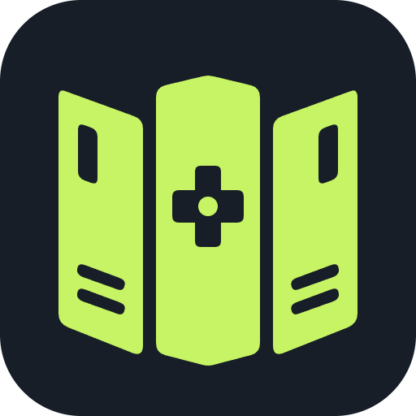

# GameAtlas for Windows

GameAtlas is an offline-first Windows game collection app with cards, list view, score colours, filters, wishlists, descriptions, and online game lookup.

## Install and first run
Each release provides two Windows downloads. Run `GameAtlas.Setup.VERSION.exe` for the normal installed edition, or place `GameAtlas.Portable.VERSION.exe` in a writable folder and run it without installing. Node.js is not required. Both executables are unsigned, so Windows may show an unknown-publisher notice.

The installed edition keeps its collection in `%APPDATA%/GameAtlas`, as before. The portable edition creates a `GameAtlas Data` folder beside its executable and keeps its database, artwork, settings, backups, and first-run state there. Keep the portable executable and that data folder together when moving it to another computer or drive. Replacing only the portable executable with a newer version preserves the adjacent data folder.

A fresh installation contains **zero games**. The first-run wizard lets you:
1. Start an empty library with the standard game fields, or import a complete .gameatlas backup or legacy JSON export.
2. Choose a local backup folder.
3. Choose backups after each library change, once a day, or manual only.

Existing installations retain their database and artwork. Upgrades do not clear a collection or replace it with the empty starter. Existing backup-folder preferences are retained; older installations default to backups after changes.

Use the cog beside Add game to reopen Settings. The footer shortcut and all property-definition editors have been removed. Game values remain editable. Imported libraries retain their existing fields; users cannot add, delete, rename, or change field definitions in the editor.

## Backup scheduling
- After changes: creates a complete local backup after a game is added, modified, or deleted.
- Once a day: runs while the app is open, checked once per minute, using the local calendar date. If the app is closed, it catches up on the next launch.
- Manual only: creates no scheduled backups. Use Save complete backup.
- Settings remain changeable at any time. Automatic modes make an initial baseline when setup/settings are saved.
- The chosen folder may be a Google Drive folder. GameAtlas writes locally; your cloud-sync software handles uploading.
- Restore always creates a safety backup in the app's internal backups folder, including in manual mode.
- The newest 10 automatic and safety backups are kept in total across the selected folder and internal backups folder. Cleanup runs on launch and after backups; recognized backups from previous versions count toward the limit. Manual exports, unrelated files, and previously selected folders are left untouched.
- Backup failures are reported after saving a game or in Settings; the game remains saved locally.

## Collection dashboard
Use Dashboard at the top of the app for two clear summary rows: All Games, Owned Physical, Owned Digital, Completed, then Playing, Must Play, Replay and Wish List. Must Play and Replay recognize matching values in either Status or Tags, and each summary opens its matching games.

The dashboard includes completion progress, owned platform/genre breakdowns and the five highest-rated owned games. Click totals or chart rows to browse those games, or a ranked game to open its details. Dashboard figures ignore active library search filters and update when your library changes.

The dashboard also highlights highest-rated owned backlog games, the five most represented Studio credits with average scores, and wishlist priorities with released/upcoming/undated groups. Combined Studio credits stay as entered. Wishlist date groups use saved dates, not live release checks; multi-priority games appear in each selected priority.

## Missing thumbnails
Settings > Check for missing artwork opens a dedicated window and closes Settings. Find artwork automatically retries missing downloads and looks up games without artwork. Only a single exact title match is applied automatically. Ambiguous or unavailable results remain in Choose artwork for the rest, where you can search another title or game link, preview a downloaded match with automatic source fallback, choose an image file, or leave the game missing for now.

The scan shows progress and can stop after the current request. It changes only artwork, preserving all game properties and descriptions. A safety backup is created before a batch; successful artwork changes follow your backup schedule. Locally selected images are copied into the library and included in complete backups. Existing downloaded artwork is skipped.

## Complete backups and restore
Save complete backup creates one .gameatlas file containing a consistent SQLite snapshot and cached thumbnail bytes, preserving all game metadata, descriptions, fields, choices, scores, links, and artwork references.

Manual backup first attempts missing linked images. If some remain unavailable, the app reports them and lets you cancel or explicitly save with missing thumbnails. Scheduled backups include what is cached at that moment and record missing images.

Restore validates the database and image checksums, creates a safety copy, and restores the collection and images together. Interrupted restores have recovery support. Older JSON imports remain supported, but have no embedded images.

Machine-specific settings and nested backup histories are not included in a library backup. Choose the backup location/schedule on the new PC during setup.

## Storage
The installed edition's live database and image cache live in `%APPDATA%/GameAtlas`, separately from this repository and the installer. The portable edition uses its adjacent `GameAtlas Data` folder. Installer upgrades preserve installed data; uninstall does not deliberately remove it.

Internet is required only for lookup, uncached artwork, opening external links, and checking for application updates.

## Branding
The Atlas Library emblem uses the existing lime (#c7f464) and charcoal palette. public/brand-mark.svg is the scalable master used in the app. Run npm run build:branding to regenerate the Windows icon and PNG from that master. The icon includes sizes from 16 through 256 pixels for Windows, plus a 512-pixel PNG.

## Development
Use Node.js 22.13 or newer on Windows:
- npm ci
- npm run build
- npm run typecheck
- npm test
- npm run test:desktop
- npm start
- npm run dist (builds both the installer and portable executable)

Generated outputs are ignored by Git. Installers are in release. Test fixtures contain generic sample games and are not packaged.

The renderer uses a sandbox, context isolation, and a limited validated preload interface. No local HTTP server is used.
The repository contains the Windows application. React, HTML, CSS, and Vite build its embedded Electron interface; they are required desktop components. There is no hosted application, deployment configuration, or web server in this source tree. Backups placed in BACKUPS can be committed to this public repository and are publicly downloadable. New or changed backups must be committed and pushed explicitly; the app does not synchronize backups with GitHub.

## Application updates
Settings > Check for updates uses the public GitHub latest-release API. A newer stable Windows release is shown with its GitHub release notes. Choose Install update to download and verify the matching installer or portable executable against its GitHub SHA-256 digest and size, then update after a complete safety backup. Not now postpones it without downloading or installing. GameAtlas closes, updates the same edition, and relaunches it. No GitHub account or token is needed.

Install version 1.4.2 or newer to review release notes and confirm before updating. Versions 1.3 through 1.4.1 still install immediately when their old Check for updates button is pressed. Older versions do not have the button. The update preserves the library and settings. No background update checks run without pressing the button. Releases must contain matching `GameAtlas.Setup.VERSION.exe` and `GameAtlas.Portable.VERSION.exe` files with GitHub asset digests. Missing assets, rate limits, offline access, failed verification, and launch errors are shown in Settings.

Use the sun/moon button beside Settings to switch between light and dark themes. Your choice is remembered on this computer between launches.

ESRB ratings appear on game cards and in list view. Use the ESRB filter or sort from Everyone first / Mature first. Unknown, pending, and unrated entries remain at the end. Ratings can be edited in game details; verified imported ratings link to the ESRB listing and its platforms. Some original releases predate ESRB. A rating for one edition should not be assumed to cover every port.

Use **Settings > Create Collection PDF** to export either the games you own physically or your entire library. Both printable catalogs include a cover page, collection totals, cached cover art, pertinent game details, notes, clickable website links, and page numbers.

Open any existing game and choose **Upload file to replace artwork** to use your own PNG, JPG, WebP, GIF, or AVIF image. GameAtlas stores a safe local copy with the library, so it is included in complete backups and restores.

Game descriptions can be edited directly in the game editor. Use **Settings > Find missing descriptions** to review games that show the missing-description message, search online for a suggested description, then review and save the text. The library uses a focused tile layout with release dates shown directly on each game card.

Opening a game first shows a clean, read-only game page with larger artwork, its description, and pertinent information as compact badges. Empty properties stay hidden. A single source is not repeated; when a game has multiple distinct sources, compact labeled links such as IGN and Steam appear near the top. Personal notes appear in a full-width Notes box at the bottom. Use the compact **Edit** button beside the close button when you want to change information or artwork, and **Back to game page** to leave the editor without keeping unsaved property changes.
